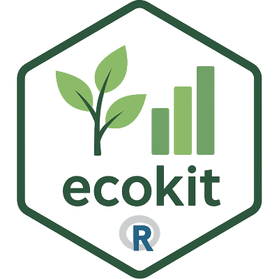

# ecokit <a href="https://elgabbas.github.io/ecokit/"></a>

<!-- badges: start -->

[](https://github.com/elgabbas/ecokit/actions/workflows/R-CMD-check.yaml)
<!-- badges: end -->

## Overview

`ecokit` is an R package offering a collection of utility functions
tailored for ecologists and R programmers. It provides tools for spatial
data manipulation, package management, and general R workflows, making
it easier to handle ecological datasets.

Explore the [full
documentation](https://elgabbas.github.io/ecokit/reference/index.html)
for a complete list of functions.

<br/>

## Installation

You can install the development version of `ecokit` from GitHub using
the `remotes` package:

``` r
# Install remotes if not already installed
if (!require("remotes")) install.packages("remotes")
# Install ecokit from GitHub
remotes::install_github("elgabbas/ecokit", dependencies = TRUE)
```

<br/>

## Contributing

`ecokit` is an open-source project, and I welcome contributions from the
community! If you encounter issues, have suggestions, or want to add new
features, please:

- **Report issues** or suggest features on the [GitHub issue
  tracker](https://github.com/elgabbas/ecokit/issues).
- **Submit pull requests** with bug fixes or enhancements via the
  [GitHub repository](https://github.com/elgabbas/ecokit).
- **Contact me** directly at *elgabbas\[at\]outlook\[dot\]com* for
  collaboration ideas or questions.

<span style="     color: grey !important;">Last update:
2026-06-05</span>
